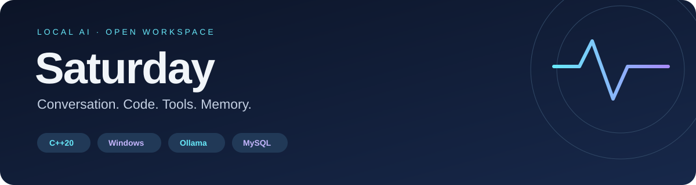

<div align="center">



**A local C++ assistant for conversation, coding, and practical tools.**

[Get started](#quick-start-windows) · [Commands](#using-saturday) · [Tools](#tools) · [Configuration](#configuration) · [Windows guide](WINDOWS.md)

</div>

---

## About Saturday

Saturday connects local Ollama models to a command-line interface, persistent MySQL memory, and system and web tools. It streams answers as they arrive and can execute a tool, save the result, and continue the conversation.

Separate C++ modules handle model orchestration, conversation storage, HTTP, TCP, files, and audio. Windows has native networking and audio implementations; Linux backends are retained.

> **Early development.** Native Windows builds, database integration, model switching, and selected tool flows have been verified. See [validation and limitations](#validation-and-limitations).

## Two models, one conversation

| Mode | Default model | Purpose |
| :--- | :--- | :--- |
| `/auto` | Gemma or Qwen | Routes recognized coding/tool requests to Qwen; otherwise uses Gemma |
| `/chat` | `gemma3:12b` | Conversation, explanations, and images; no native tools or thinking output |
| `/code` | `qwen3.5:9b` | Coding, thinking output, and tool calls |

Routing uses keyword matching. Explicit web-search requests are recognized; unusual phrasing may need `/code`. Both models share saved conversation history. Tool availability does not force a call: a model may reuse earlier results. Request a **fresh search** when needed and look for `[tool-call]`.

## Quick start: Windows

### 1. Install prerequisites

| Requirement | Details |
| :--- | :--- |
| C++ toolchain | Tested with **MSYS2 UCRT64 GCC 14.2** and `mingw32-make`, available on PATH |
| CMake | **3.24 or newer**, available on PATH |
| MySQL Server | Tested with **8.0**, including C headers and `libmysql` |
| Ollama | Running locally with the models below |
| Tavily | Optional API key; needed for web search |

MySQL Workbench is an optional GUI for managing the server. Saturday connects to **MySQL Server**, not to Workbench. Python and Node.js are not needed to run the application.

Clone or download this repository, then open PowerShell in its root folder. Install the models:

```powershell
ollama pull gemma3:12b
ollama pull qwen3.5:9b
```

If Ollama is not running, start `ollama serve` in another terminal. Keep the MySQL service running too.

### 2. Configure your local account

Create your private configuration without overwriting an existing file:

```powershell
if (!(Test-Path .env)) { Copy-Item .env.example .env }
notepad .env
```

Set `DATABASE_USERNAME` to an **existing MySQL account** and enter its password. The example username is a placeholder; setup does not create an account. Add a Tavily key if you want web search. Keep these defaults unless your installation differs:

```dotenv
DATABASE_HOST=127.0.0.1
DATABASE_PORT=3306
DATABASE_PATH=saturday
SYSTEM_PROMPT_PATH=system_prompt.txt
```

`DATABASE_PATH` is a database name, not a file path. **Never enter real credentials in .env.example.** Private `.env` files are ignored by Git.

### 3. Build and initialize once

```powershell
.\scripts\build-windows.ps1
.\scripts\run-windows.ps1 --init-db
.\scripts\run-windows.ps1 --check-db
```

The first build downloads pinned curl, simdjson, yyjson, and Lexbor sources and needs internet access. If MySQL is installed elsewhere:

```powershell
.\scripts\build-windows.ps1 -MySqlRoot 'C:\path\to\MySQL Server 8.0'
```

`--init-db` creates the configured database and missing tables without deleting existing data. It requires CREATE permission. Alternatively, an administrator can run [sql/schema.sql](sql/schema.sql) in Workbench and grant your application account access. That script uses the default database name `saturday`.

### 4. Run every day

From the repository root:

```powershell
.\scripts\run-windows.ps1
```

For the tested MinGW build, you can also run:

```powershell
.\build\saturday.exe
```

**You do not need to rebuild, initialize, or check the database each time.** Rebuild only after source changes. Saturday reconnects using your saved configuration. Restart after changing `.env` or the system prompt.

## Using Saturday

| Input | Behavior |
| :--- | :--- |
| `/end` | Submit the multiline message |
| `/auto` | Automatic model routing; the default |
| `/chat` | Select Gemma for subsequent messages |
| `/code` | Select Qwen and its tools for subsequent messages |
| `img>>> C:/path/image.png` | Attach a local image; include a text prompt too |
| `exit` or `quit` | Exit cleanly |

Type commands without a space after `/`. A selected mode remains active until changed.

**Understand a file without editing it:**

```text
/code
Read main.cpp and explain the application flow. Do not modify files.
/end
```

**Run a fresh web search:**

```text
/auto
Perform a fresh web search for MySQL Workbench official documentation.
Call web_search now and cite URLs returned by the tool.
Do not reuse previous results. Report any tool error accurately.
/end
```

Expect `[model] qwen3.5:9b` and `[tool-call] searching web...`. An answer claiming a search is not proof that a tool ran.

## Tools

| Tool | Behavior |
| :--- | :--- |
| `web_search` | Search Tavily; requires `TAVILY_API_KEY` |
| `fetch_url` | Fetch HTML/text/JSON and extract readable HTML text |
| `read_file` | Read a local file |
| `write_file` | Create a file or **append** to an existing file |
| `edit_file` | Replace exact text with occurrence count/offset controls |
| `list_dir` | List entries, including hidden files |
| `get_current_datetime` | Read the local system date and time |
| `open_browser` | Open an HTTP(S) URL in the default browser |
| `connect_to_tcp` | Connect to a TCP server |
| `send_data_tcp` | Send data and report bytes sent; does not wait for a reply |

Tools use the application's OS permissions. File writes and network actions are real operations. A separate tool sandbox or permission dialog is not implemented.

## Configuration

See [.env.example](.env.example). Existing process environment variables override the file. Values are literal; shell expansion is not performed.

| Variable | Purpose |
| :--- | :--- |
| `DATABASE_HOST`, `DATABASE_PORT` | MySQL server address |
| `DATABASE_PATH` | Database name |
| `DATABASE_USERNAME`, `DATABASE_PASSWORD` | MySQL account credentials |
| `OLLAMA_URL` | Chat endpoint; default `http://localhost:11434/api/chat` |
| `OLLAMA_MODEL` | Default conversation model |
| `OLLAMA_CODING_MODEL` | Coding/tool model |
| `OLLAMA_TOOLS`, `OLLAMA_THINKING` | Default-model capabilities; false for Gemma 3 |
| `OLLAMA_CODING_TOOLS`, `OLLAMA_CODING_THINKING` | Coding-model capabilities; true for Qwen 3.5 |
| `TAVILY_API_KEY` | Optional web-search credential |
| `SYSTEM_PROMPT_PATH` | Instructions file; use `system_prompt.txt` |

Inference goes to your configured Ollama endpoint, and conversation data goes to MySQL. Tavily searches and fetched URLs use external services. Images are stored as local paths and reread when constructing requests.

## Project layout

```text
Saturday/
├── main.cpp              # Terminal interface and setup commands
├── include/              # Class interfaces and shared types
├── src/                  # Model, database, tools, and platform backends
├── tools/                # Ten JSON function definitions
├── sql/                  # Schema and prepared-statement queries
├── tests/                # Platform and core regression suites
├── scripts/              # Windows build and launch helpers
├── docs/assets/          # README artwork
├── system_prompt.txt     # Default assistant instructions
├── .env.example          # Public template, without credentials
├── CMakeLists.txt        # Build and dependency configuration
├── Makefile              # CMake convenience wrapper
├── WINDOWS.md            # Detailed Windows notes
└── README.md
```

Private configuration, build output, downloaded models, logs, and local artifacts stay outside Git.

## Validation and limitations

```powershell
ctest --test-dir build --output-on-failure
```

Both suites cover queue shutdown, configuration parsing, Windows loopback TCP, split response parsing, routing, Base64 encoding, Unicode file operations, result cleanup, and all ten tool schemas.

Live checks have exercised MySQL setup/authentication, Gemma chat, Qwen time-tool calls, Tavily search, and persistent history across model switches. This does not mean every tool has been tested against every service.

- Physical audio is untested. Audio classes are present but not connected to a voice-chat workflow.
- Direct llama.cpp inference is experimental and disabled by default. It needs compatible headers/libraries and `-DSATURDAY_LLAMA=ON`.
- Linux backends are retained but were not rebuilt in this Windows session. MSVC is not verified.
- All messages share one chat table. Separate sessions and automatic history summarization are not implemented.
- Large models require sufficient RAM/VRAM and may take time to load.

### Linux build

Install a C++20 compiler, CMake, MySQL/MariaDB client development files, and ALSA development files. Configure `.env` and start MySQL/Ollama, then run:

```bash
cmake -S . -B build -DCMAKE_BUILD_TYPE=Release
cmake --build build --parallel
ctest --test-dir build --output-on-failure
./build/saturday --init-db
./build/saturday
```

## Troubleshooting

| Symptom | Check |
| :--- | :--- |
| MySQL access denied | Use a valid account/password; the example does not create an account |
| Missing database/tables | Run `--init-db` with sufficient privileges or apply the schema in Workbench |
| Ollama connection failure | Start Ollama and check `OLLAMA_URL` |
| Model not found | Check `ollama list` and pull the configured model |
| No web tool call | Select `/auto` or `/code` and explicitly request a fresh search |
| Search error | Check the Tavily key, connectivity, and API response |
| Cannot replace saturday.exe | Exit the running application before rebuilding |
| SQL/tool files missing | Launch from the repository root or use the run script |
| Missing compiler DLL | Keep MSYS2 UCRT64's bin directory on PATH |

## License

No license has been selected or included yet.
